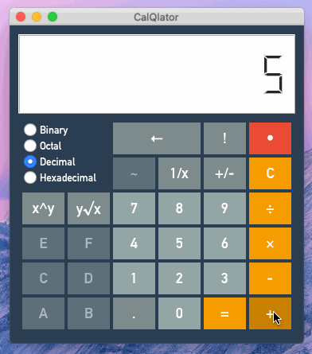
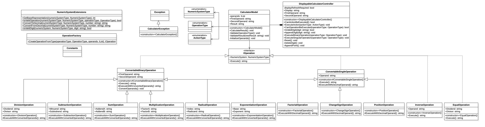

# CalQlator

CalQlator is a calculator capable to change its numeric system to BIN, OCT, DEC and HEX. Also it includes a lot of useful operations.



## Built With

* [Python3](https://www.python.org/)
* [C#](https://docs.microsoft.com/en-us/dotnet/csharp/)
* [PyQt](https://riverbankcomputing.com/software/pyqt/intro)

## Getting Started

### Installing

There is an already created file for Linux.

```sh
curl -L "https://raw.githubusercontent.com/jcflow/CalQlator/master/dist/CalQlator" -o CalQlator
chmod +x CalQlator
./CalQlator
```

Also there is a MacOS version here.

```sh
svn checkout "https://github.com/jcflow/CalQlator/trunk/dist/CalQlator.app"
open CalQlator.app
```

### Execution
```sh
pip3 install -r requirements.txt
dotnet build --configuration Release --output build/
python3 main.py
```

### Build it yourself
```sh
pip3 install -r requirements.txt
dotnet build --configuration Release --output build/
python3 main.py
pyinstaller CalQlator.spec
```

## Architecture

### Models
The core base of the application is using C#.



### Controllers
The controllers of the application is using Python 3.x.
* Main Controller
* Voice Controller
**USAGE:** All keywords for the voice recognition are stored in `Controllers/dictionary.json`

### Views
The views of the application is using Python 3.x and PyQt.

## License

This project is licensed under the MIT License - see the [LICENSE.md](LICENSE.md) file for details
